# 📊 Diagramas - DarkAgent Pro v2.0

## Diagramas de Arquitetura e Fluxos

Este documento contém todos os diagramas Mermaid do sistema DarkAgent Pro v2.0.

---

## 1. 🏗️ Diagrama de Arquitetura do Sistema

### Visão Geral dos Componentes

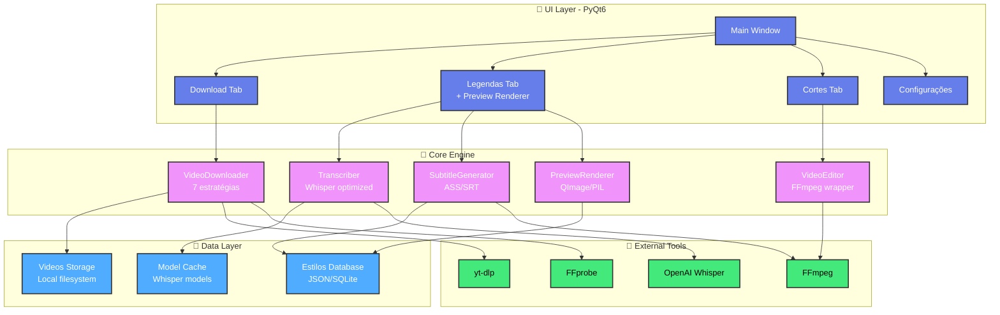

### Descrição dos Componentes:

#### 🎨 UI Layer (PyQt6)
- **Main Window**: Janela principal com abas e menu
- **Download Tab**: Interface para inserir URL e configurações de download
- **Legendas Tab**: Galeria de estilos + preview em tempo real + editor visual
- **Cortes Tab**: Ferramentas para cortar e segmentar vídeos
- **Configurações**: Preferências do usuário e caminhos

#### 🧠 Core Engine
- **VideoDownloader**: Sistema de 7 estratégias com fallback automático
- **Transcriber**: Wrapper otimizado do Whisper (GPU/CPU)
- **SubtitleGenerator**: Gerador de arquivos ASS/SRT com estilos
- **VideoEditor**: Wrapper do FFmpeg para cortes e overlay
- **PreviewRenderer**: Renderizador de previews usando QImage

#### 💾 Data Layer
- **Model Cache**: Armazena modelos Whisper baixados
- **Estilos Database**: JSON com 12+ estilos de legendas
- **Videos Storage**: Armazenamento local de vídeos processados

#### 🔧 External Tools
- **yt-dlp**: Download de vídeos do YouTube
- **FFmpeg**: Processamento de vídeo (merge, corte, overlay)
- **FFprobe**: Validação de streams de áudio/vídeo
- **OpenAI Whisper**: Transcrição de áudio para texto

---

## 2. 🔄 Fluxo de Processamento Completo

### Sequência de Operações (URL → Vídeo Processado)

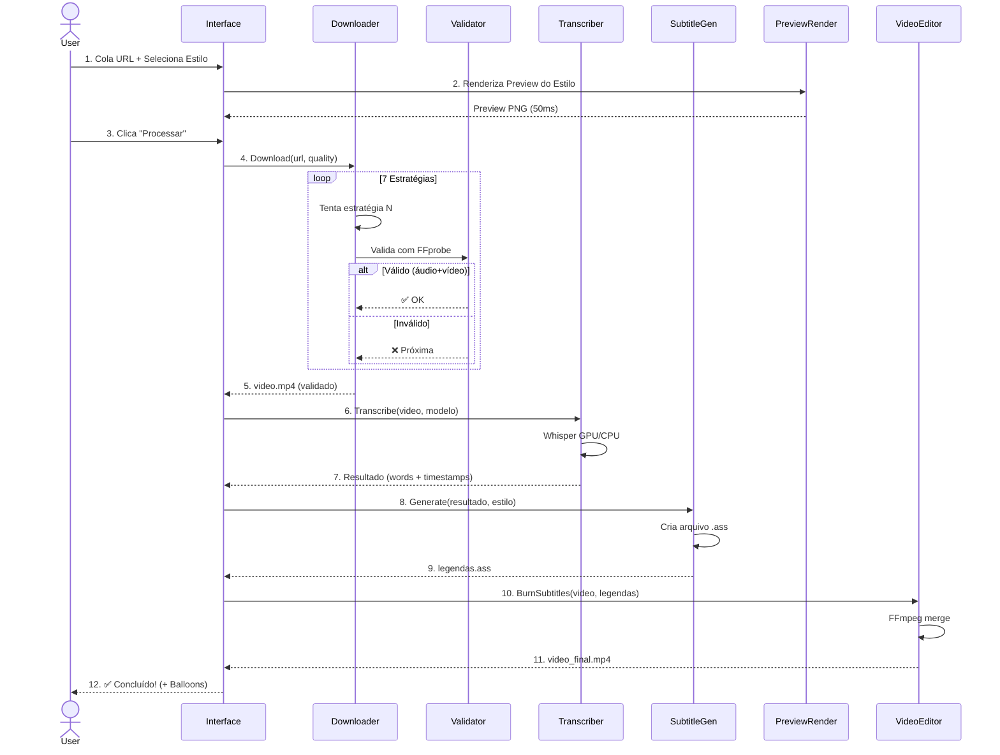

### Descrição do Fluxo:

1. **Usuário cola URL**: Insere link do YouTube e escolhe estilo de legenda
2. **Preview instantâneo**: Sistema renderiza preview do estilo em <50ms
3. **Iniciar processamento**: Usuário clica no botão "Processar"
4. **Download robusto**: Sistema tenta 7 estratégias até conseguir
5. **Validação tripla**: FFprobe verifica áudio, vídeo e duração
6. **Transcrição IA**: Whisper gera texto com timestamps palavra-por-palavra
7. **Geração de legendas**: Cria arquivo ASS com estilo escolhido
8. **Queima de legendas**: FFmpeg incorpora legendas no vídeo
9. **Vídeo final**: Salvo no disco com legendas permanentes

**Tempo total**: <5 minutos para vídeo de 5 min (720p, modelo Base)

---

## 3. 🎨 Fluxo de Preview de Legendas

### Máquina de Estados do Sistema de Preview

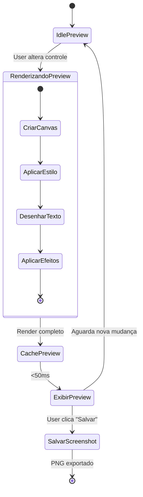

### Descrição dos Estados:

#### IdlePreview
- Sistema aguardando interação do usuário
- Preview atual exibido na tela
- CPU/GPU em idle

#### RenderizandoPreview
1. **CriarCanvas**: Cria QImage 1280x720
2. **AplicarEstilo**: Aplica fonte, cor, borda do estilo
3. **DesenharTexto**: Renderiza texto de exemplo
4. **AplicarEfeitos**: Adiciona sombra, outline, etc.

#### CachePreview
- Armazena render em cache para reutilização
- Key: `{estilo_id}_{hash(config)}`
- Evita re-render desnecessário

#### ExibirPreview
- Atualiza widget Qt com nova imagem
- Latência: <50ms (meta)
- Usuário vê mudança instantaneamente

#### SalvarScreenshot
- Exporta preview como PNG 1280x720
- Usado para compartilhamento/referência

---

## 4. 🔽 Sistema de Download Multi-Estratégia

### Fluxograma de Fallback

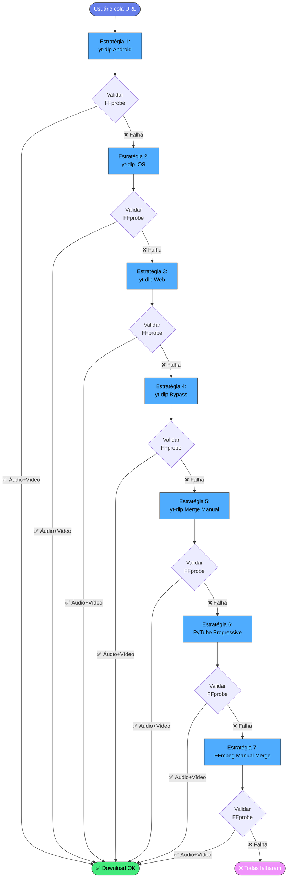

### Validação FFprobe (Cada Estratégia)

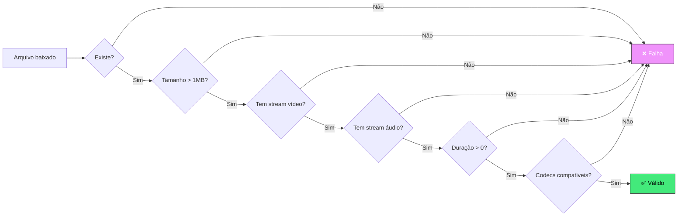

---

## 5. 🎬 Pipeline de Processamento de Vídeo

### Visão Geral End-to-End

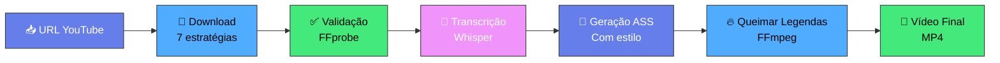

### Tempos Estimados (Vídeo 5min, 720p, modelo Base)

| Etapa | Tempo | Progresso |
|-------|-------|-----------|
| Download | 30-60s | 0-30% |
| Validação | 1-3s | 30-32% |
| Transcrição | 20-40s | 32-70% |
| Geração ASS | 0.5-1s | 70-72% |
| Queima Legendas | 60-120s | 72-100% |
| **TOTAL** | **2-4 min** | **100%** |

---

## 6. 🎨 Arquitetura do Editor Visual de Legendas

### Componentes da Interface de Edição

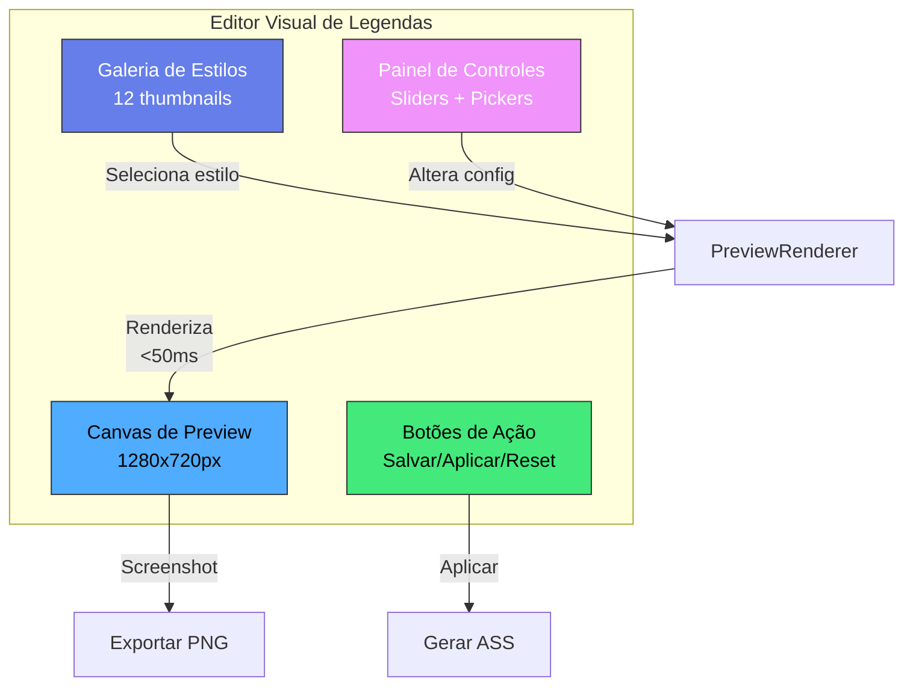

### Controles Disponíveis

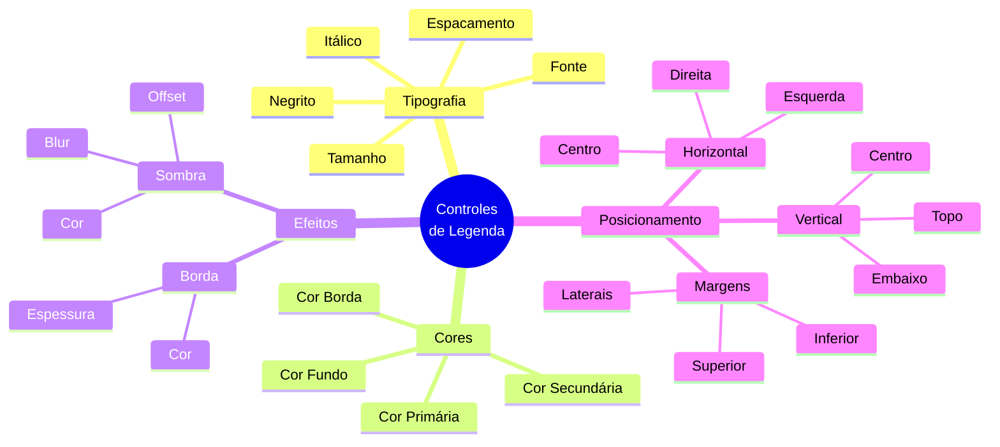

---

## 7. 🗄️ Modelo de Dados

### Estrutura da Classe EstiloLegenda

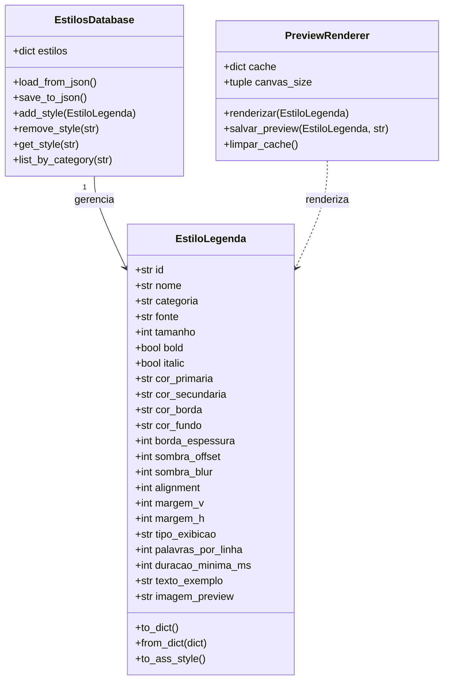

---

## 8. 🚀 Fluxo de Inicialização do Aplicativo

### Sequência de Startup

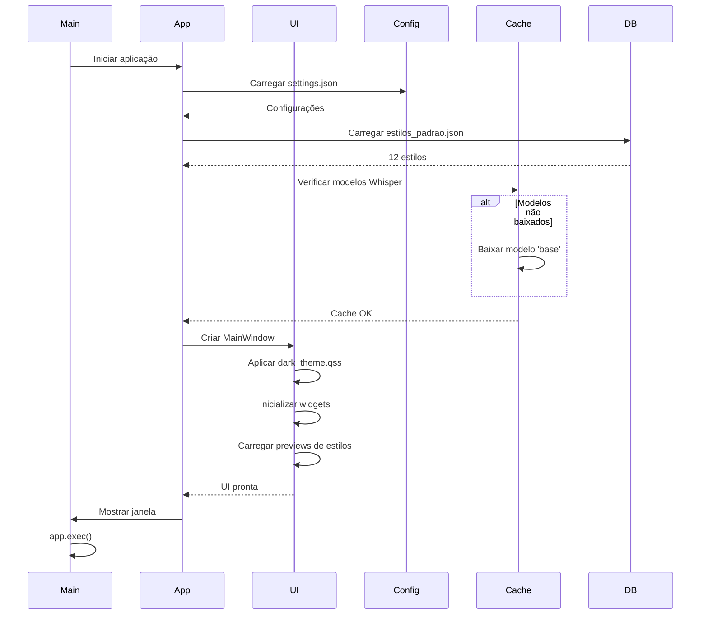

---

## 9. 📊 Monitoramento de Performance

### Dashboard de Métricas

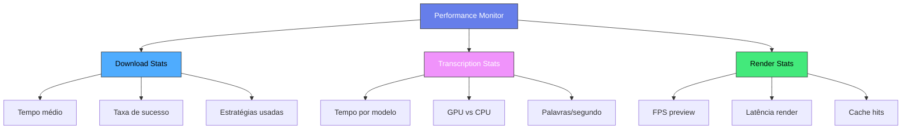

---

## 10. 🔐 Fluxo de Tratamento de Erros

### Sistema de Fallback e Recovery

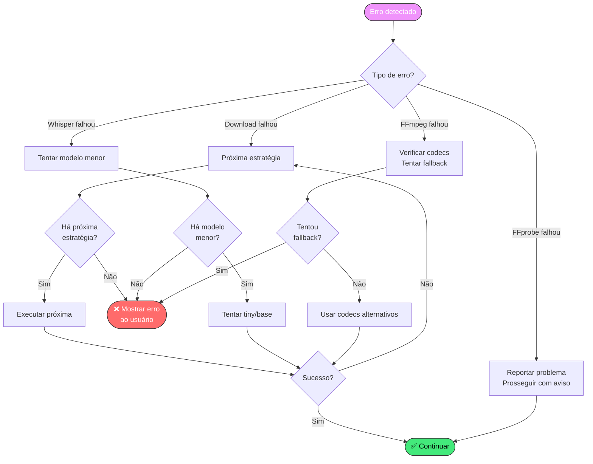

---

## 11. 🎯 Ciclo de Vida do Processamento

### Estados do Job de Processamento

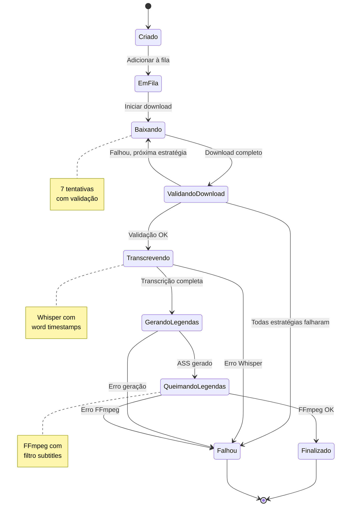

---

## 12. 🎨 Sistema de Cache Multi-Nível

### Hierarquia de Cache

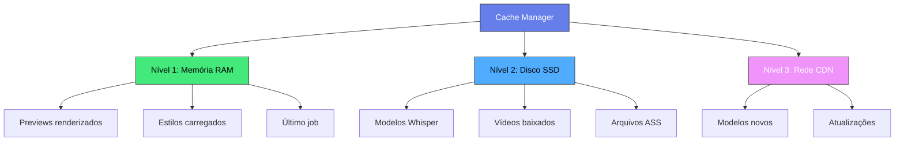

### Política de Evicção

| Tipo | TTL | Max Size | Evicção |
|------|-----|----------|---------|
| Previews RAM | 1 hora | 100 MB | LRU |
| Modelos Whisper | Infinito | 5 GB | Manual |
| Vídeos baixados | 7 dias | 20 GB | FIFO |
| Arquivos ASS | 30 dias | 500 MB | LRU |

---

## 13. 🔄 Integração com Ferramentas Externas

### Comunicação com FFmpeg

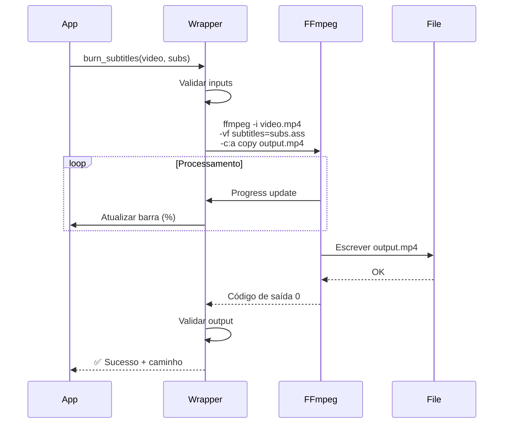

---

## 14. 📱 Exportação Multi-Formato

### Fluxo de Exportação

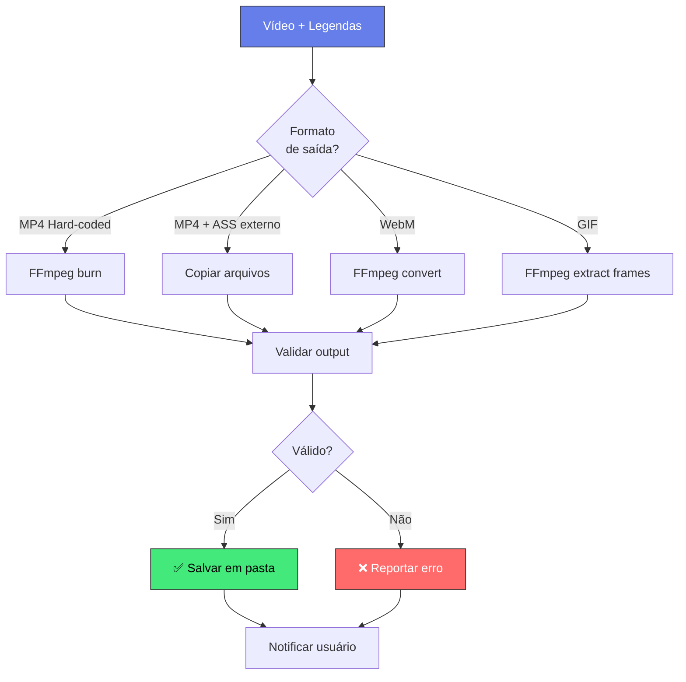

---

## 15. 🎯 Resumo Visual da Arquitetura

### Big Picture

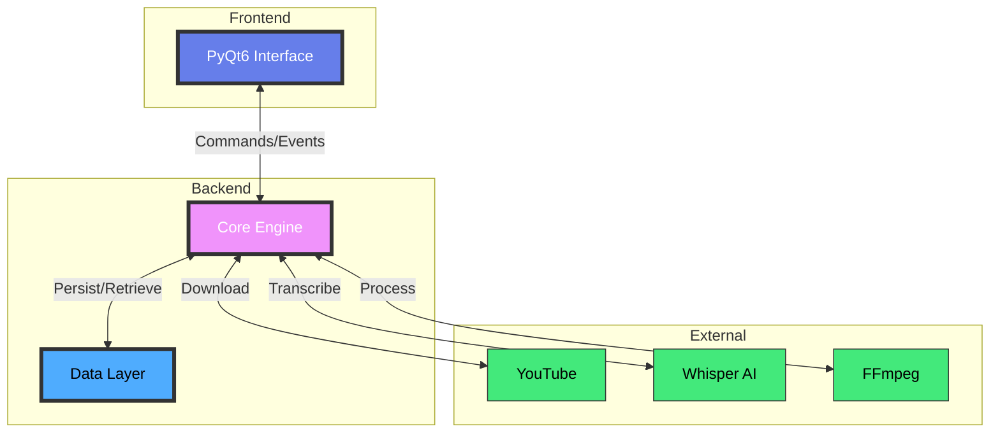

---

## 16. 📈 Roadmap Visual

### Timeline de Desenvolvimento

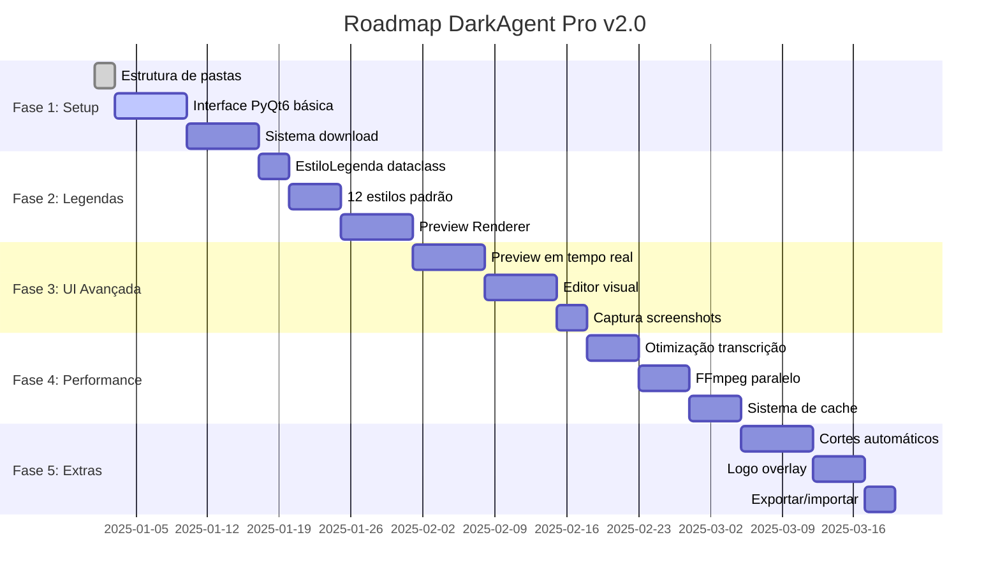

---

## Conclusão

Estes diagramas representam a arquitetura completa do **DarkAgent Pro v2.0**, cobrindo:

✅ **Arquitetura de componentes** (camadas UI/Core/Data/External)  
✅ **Fluxos de processamento** (download, transcrição, preview)  
✅ **Máquinas de estado** (preview, jobs, erros)  
✅ **Integração com ferramentas** (FFmpeg, Whisper, yt-dlp)  
✅ **Sistema de cache** (memória, disco, rede)  
✅ **Roadmap de desenvolvimento** (5 fases, 10 semanas)

---

**Como usar estes diagramas:**

1. **Desenvolvedores**: Use como referência durante implementação
2. **Arquitetos**: Valide decisões de design e integrações
3. **Gerentes**: Acompanhe progresso e dependências entre fases
4. **Documentação**: Incorpore em wikis e READMEs

**Ferramentas para renderizar:**

- **VS Code**: Extensão "Markdown Preview Mermaid Support"
- **GitHub/GitLab**: Suporte nativo para blocos ```mermaid```
- **Mermaid Live Editor**: https://mermaid.live/
- **Obsidian**: Renderização automática de Mermaid

---

**Versão:** 2.0  
**Data de Criação:** 12/11/2025  
**Última Atualização:** 12/11/2025  
**Autor:** Guilherme (DarkAgent Pro)

---

📧 **Contato:** suporte@darkagent.pro  
🌐 **Website:** https://darkagent.pro  
💬 **Discord:** https://discord.gg/darkagent
