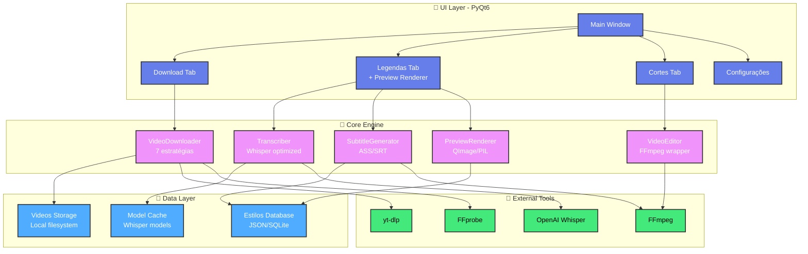
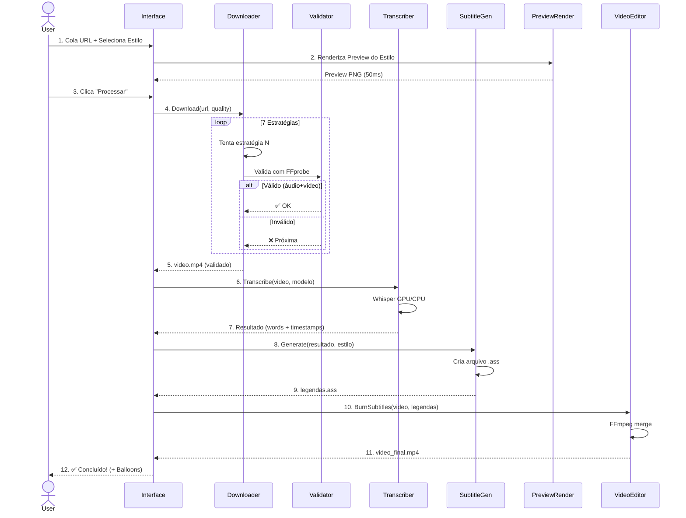
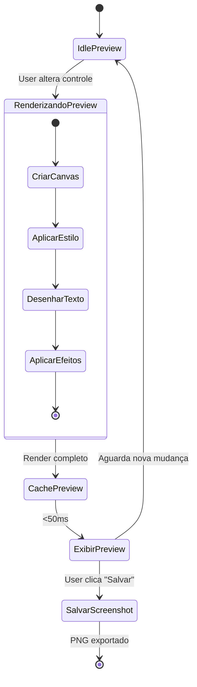

# 📋 PRD - DarkAgent Pro v2.0

## Product Requirements Document

**Versão:** 2.0  
**Data:** 12/11/2025  
**Autor:** Guilherme (DarkAgent Pro)  
**Status:** 🟢 Aprovado para desenvolvimento

---

## 1. 🎯 Visão Geral do Produto

### 1.1 Objetivo
Criar um sistema desktop profissional para processamento de vídeos do YouTube com foco em:
- Download ultra-robusto (7 estratégias de fallback)
- Transcrição rápida com IA (Whisper otimizado)
- Geração de legendas personalizáveis em tempo real
- Preview visual instantâneo de estilos
- Edição avançada de vídeos (cortes, logos, efeitos)

### 1.2 Público-Alvo
- **Criadores de conteúdo** (TikTok, Instagram Reels, YouTube Shorts)
- **Agências de marketing digital**
- **Editores de vídeo profissionais**
- **Produtores de conteúdo educacional**

### 1.3 Proposta de Valor
> "Transforme vídeos do YouTube em conteúdo viral em minutos, com legendas profissionais e cortes automáticos impulsionados por IA."

---

## 2. 🎨 Requisitos de Design (UI/UX)

### 2.1 Interface Principal

#### Layout Geral
```
┌─────────────────────────────────────────────────────────┐
│  🎬 DarkAgent Pro                    [Minimizar] [X]    │
├─────────────────────────────────────────────────────────┤
│                                                           │
│  ┌───────────────────────────────────────────────────┐  │
│  │  🔗 Cole o link do YouTube aqui                   │  │
│  └───────────────────────────────────────────────────┘  │
│                                                           │
│  ┌─────────────────┬─────────────────┬─────────────┐   │
│  │ 📊 Qualidade    │ 🤖 Modelo IA    │ 📁 Pasta    │   │
│  │ [720p ▼]        │ [Base ▼]        │ [C:\...]    │   │
│  └─────────────────┴─────────────────┴─────────────┘   │
│                                                           │
│  ┌────────────────── LEGENDAS ──────────────────────┐   │
│  │                                                    │   │
│  │  ┌──────┬──────┬──────┬──────┬──────┬──────┐    │   │
│  │  │TikTok│Reels │YT    │Clean │Neon  │Bold  │    │   │
│  │  │ [✓]  │      │      │      │      │      │    │   │
│  │  └──────┴──────┴──────┴──────┴──────┴──────┘    │   │
│  │                                                    │   │
│  │  ┌────────────────────────────────────────────┐  │   │
│  │  │         PREVIEW DA LEGENDA                  │  │   │
│  │  │  ┌────────────────────────────────────┐    │  │   │
│  │  │  │                                     │    │  │   │
│  │  │  │     Esta PALAVRA está em destaque  │    │  │   │
│  │  │  │                                     │    │  │   │
│  │  │  └────────────────────────────────────┘    │  │   │
│  │  └────────────────────────────────────────────┘  │   │
│  │                                                    │   │
│  │  🎨 PERSONALIZAÇÃO                                │   │
│  │  ┌──────────────────────────────────────┐        │   │
│  │  │ Fonte: [Arial ▼]  Tamanho: [48]      │        │   │
│  │  │ Cor 1: [🟡]  Cor 2: [⚪]             │        │   │
│  │  │ Posição: [●○○○○○○○○] Embaixo        │        │   │
│  │  │ Borda: [●●○○○] Sombra: [●●●○○]      │        │   │
│  │  └──────────────────────────────────────┘        │   │
│  │                                                    │   │
│  │  [🎬 PROCESSAR COM LEGENDAS]                      │   │
│  └────────────────────────────────────────────────────┘   │
│                                                           │
│  ┌────────────────── CORTES & LOGO ──────────────────┐   │
│  │  Logo: [📁 Selecionar]  Posição: [Superior ▼]    │   │
│  │  Cortes: [3] x [30s]  Formato: [Vertical ▼]      │   │
│  │  [✂️ GERAR CORTES AUTOMÁTICOS]                    │   │
│  └────────────────────────────────────────────────────┘   │
│                                                           │
│  [████████████████████████] 75% Transcrevendo...         │
│                                                           │
└─────────────────────────────────────────────────────────┘
```

### 2.2 Sistema de Preview de Legendas

#### Requisitos de Preview em Tempo Real

**FR-UI-001: Preview Instantâneo**
- **Descrição**: Ao selecionar um estilo de legenda, mostrar preview visual em menos de 100ms
- **Entrada**: Clique no card de estilo (TikTok, Reels, etc.)
- **Saída**: Canvas 640x360px com texto renderizado no estilo escolhido
- **Tecnologia**: PyQt6 QPainter + cache de renders

**FR-UI-002: Captura de Tela de Preview**
```python
# Exemplo de implementação
def capturar_preview_legenda(estilo: str) -> Image:
    """
    Gera imagem PNG 1280x720 com preview da legenda
    
    Args:
        estilo: "tiktok", "reels", "youtube", etc.
    
    Returns:
        PIL.Image com preview renderizado
    """
    canvas = QImage(1280, 720, QImage.Format_RGB32)
    painter = QPainter(canvas)
    
    # Aplicar estilo
    fonte = ESTILOS[estilo]['fonte']
    cor = ESTILOS[estilo]['cor']
    posicao = ESTILOS[estilo]['posicao']
    
    # Renderizar texto de exemplo
    painter.setFont(QFont(fonte['familia'], fonte['tamanho']))
    painter.setPen(cor)
    painter.drawText(posicao, "Esta PALAVRA está em destaque")
    
    painter.end()
    return canvas_to_pil(canvas)
```

**FR-UI-003: Galeria de Estilos**
- Mínimo **12 estilos pré-configurados**:
  1. TikTok Classic (palavra destacada amarela)
  2. TikTok Bold (palavra grande colorida)
  3. Instagram Reels (palavra centralizada)
  4. YouTube Shorts (frases embaixo)
  5. Clean Minimal (branco simples)
  6. Neon Glow (efeito brilho)
  7. Bold Impact (maiúscula preta/branca)
  8. Gradient Wave (gradiente animado)
  9. Outline Style (contorno grosso)
  10. Shadow Pop (sombra pronunciada)
  11. Typewriter (palavra por palavra suave)
  12. Karaoke (preenchimento horizontal)

### 2.3 Editor Visual de Legendas

**FR-UI-004: Controles Interativos**

```python
# Controles na UI
controles = {
    'fonte': QComboBox(['Arial', 'Helvetica', 'Impact', 'Comic Sans', ...]),
    'tamanho': QSlider(24, 120, default=48),
    'cor_primaria': QColorButton(default='#FFFF00'),
    'cor_secundaria': QColorButton(default='#FFFFFF'),
    'posicao_vertical': QSlider(0, 100, default=85),  # 0=topo, 100=fundo
    'posicao_horizontal': QRadioButton(['Esquerda', 'Centro', 'Direita']),
    'borda_espessura': QSlider(0, 10, default=3),
    'borda_cor': QColorButton(default='#000000'),
    'sombra_offset': QSlider(0, 20, default=5),
    'sombra_blur': QSlider(0, 30, default=10),
    'espacamento_linhas': QSlider(1.0, 3.0, default=1.5, step=0.1),
    'margem_lateral': QSlider(0, 200, default=50),
}
```

**FR-UI-005: Preview em Tempo Real ao Ajustar**
- Qualquer mudança nos sliders/dropdowns atualiza o preview em <50ms
- Usar debouncing para evitar renderizações excessivas
- Cache de última configuração para undo/redo

---

## 3. ⚡ Requisitos de Performance

### 3.1 Otimização de Transcrição

**FR-PERF-001: Transcrição Rápida**

| Modelo | Tempo Máximo (1min vídeo) | GPU | CPU |
|--------|---------------------------|-----|-----|
| Tiny   | 6s                        | 3s  | 10s |
| Base   | 15s                       | 8s  | 25s |
| Small  | 30s                       | 15s | 50s |
| Medium | 60s                       | 30s | 120s|

**Implementação**:
```python
def transcrever_otimizado(audio_path, modelo="base"):
    """Transcrição ultra-otimizada"""
    import torch
    import whisper
    
    # Detectar hardware
    device = "cuda" if torch.cuda.is_available() else "cpu"
    
    # Configurações otimizadas por modelo
    CONFIGS = {
        "tiny": {"beam_size": 3, "best_of": 3, "temperature": 0.0},
        "base": {"beam_size": 5, "best_of": 5, "temperature": 0.0},
        "small": {"beam_size": 5, "best_of": 5, "temperature": [0.0, 0.2]},
        "medium": {"beam_size": 5, "best_of": 5, "temperature": [0.0, 0.2, 0.4]}
    }
    
    # Carregar modelo com cache
    if modelo not in MODEL_CACHE:
        MODEL_CACHE[modelo] = whisper.load_model(
            modelo, 
            device=device,
            download_root="./models"  # Cache local
        )
    
    model = MODEL_CACHE[modelo]
    
    # Transcrever
    resultado = model.transcribe(
        audio_path,
        language="pt",
        word_timestamps=True,
        fp16=torch.cuda.is_available(),
        **CONFIGS[modelo]
    )
    
    # Liberar memória GPU
    if device == "cuda":
        torch.cuda.empty_cache()
    
    return resultado
```

### 3.2 Geração Rápida de Legendas

**FR-PERF-002: Renderização ASS Otimizada**
- Gerar arquivo `.ass` em <500ms para vídeo de 5min
- Usar templates pré-compilados
- Evitar I/O desnecessário

```python
def gerar_ass_rapido(palavras, estilo_config):
    """Geração otimizada de arquivo ASS"""
    from io import StringIO
    
    # Template pré-compilado
    template = ASS_TEMPLATES[estilo_config['tipo']]
    
    # Construir em memória (evita I/O)
    buffer = StringIO()
    buffer.write(template.header)
    
    # Processar em batch
    batch_size = 100
    for i in range(0, len(palavras), batch_size):
        batch = palavras[i:i+batch_size]
        linhas = [formatar_linha(p, estilo_config) for p in batch]
        buffer.write('\n'.join(linhas) + '\n')
    
    return buffer.getvalue()
```

### 3.3 FFmpeg Paralelo

**FR-PERF-003: Processamento Multi-Thread**
```python
def processar_videos_paralelo(jobs):
    """Processar múltiplos vídeos simultaneamente"""
    from concurrent.futures import ThreadPoolExecutor
    
    max_workers = min(4, os.cpu_count())  # Max 4 FFmpeg simultâneos
    
    with ThreadPoolExecutor(max_workers=max_workers) as executor:
        futures = [
            executor.submit(queimar_legendas, job['video'], job['legenda'])
            for job in jobs
        ]
        
        resultados = [f.result() for f in futures]
    
    return resultados
```

---

## 4. 🔧 Requisitos Funcionais Detalhados

### 4.1 Download de Vídeos

**FR-DL-001: Sistema de 7 Estratégias**
| # | Estratégia | Prioridade | Fallback para |
|---|-----------|------------|---------------|
| 1 | yt-dlp Android | Alta | #2 |
| 2 | yt-dlp iOS | Alta | #3 |
| 3 | yt-dlp Web | Média | #4 |
| 4 | yt-dlp Bypass | Média | #5 |
| 5 | yt-dlp Merge Manual | Baixa | #6 |
| 6 | PyTube Progressive | Baixa | #7 |
| 7 | FFmpeg Merge Manual | Último | Erro |

**FR-DL-002: Validação com FFprobe**
```python
def validar_video_completo(caminho):
    """Validação tripla"""
    checks = {
        'tem_video': verificar_stream_video(caminho),
        'tem_audio': verificar_stream_audio(caminho),
        'duracao_valida': obter_duracao(caminho) > 0,
        'tamanho_minimo': os.path.getsize(caminho) > 1_000_000,  # 1MB
        'codec_compativel': verificar_codecs(caminho)
    }
    
    return all(checks.values()), checks
```

### 4.2 Sistema de Estilos de Legendas

**FR-LEG-001: Estrutura de Dados de Estilos**

```python
from dataclasses import dataclass
from typing import Tuple, Literal

@dataclass
class EstiloLegenda:
    """Definição completa de um estilo de legenda"""
    
    # Identificação
    id: str  # "tiktok_classic"
    nome: str  # "TikTok Classic"
    categoria: Literal["social", "profissional", "criativo"]
    
    # Tipografia
    fonte: str = "Arial"
    tamanho: int = 48
    bold: bool = True
    italic: bool = False
    
    # Cores (formato ASS: &HBBGGRR)
    cor_primaria: str = "&H00FFFFFF"  # Branco
    cor_secundaria: str = "&H0000FFFF"  # Amarelo
    cor_borda: str = "&H00000000"  # Preto
    cor_fundo: str = "&H80000000"  # Transparente
    
    # Efeitos
    borda_espessura: int = 3
    sombra_offset: int = 2
    sombra_blur: int = 3
    
    # Posicionamento
    alignment: int = 2  # 2=embaixo, 5=centro, 8=topo
    margem_v: int = 30  # Distância vertical das bordas
    margem_h: int = 50  # Distância horizontal das bordas
    
    # Comportamento
    tipo_exibicao: Literal["palavra", "frase", "karaoke", "palavra_destacada"]
    palavras_por_linha: int = 3
    duracao_minima_ms: int = 300  # Tempo mínimo de exibição
    
    # Preview
    texto_exemplo: str = "Esta PALAVRA está em destaque"
    imagem_preview: str = "assets/previews/tiktok_classic.png"


# Biblioteca de estilos pré-configurados
ESTILOS_PADRAO = {
    "tiktok_classic": EstiloLegenda(
        id="tiktok_classic",
        nome="TikTok Classic",
        categoria="social",
        cor_secundaria="&H0000FFFF",  # Amarelo brilhante
        tipo_exibicao="palavra_destacada",
        palavras_por_linha=3
    ),
    
    "reels_bold": EstiloLegenda(
        id="reels_bold",
        nome="Instagram Reels Bold",
        categoria="social",
        tamanho=64,
        alignment=5,  # Centro
        tipo_exibicao="palavra",
        margem_v=200
    ),
    
    "youtube_standard": EstiloLegenda(
        id="youtube_standard",
        nome="YouTube Padrão",
        categoria="profissional",
        tamanho=36,
        bold=False,
        tipo_exibicao="frase",
        palavras_por_linha=10
    ),
    
    "neon_glow": EstiloLegenda(
        id="neon_glow",
        nome="Neon Glow",
        categoria="criativo",
        tamanho=56,
        cor_primaria="&H00FFFF00",  # Ciano
        sombra_blur=10,
        sombra_offset=0,
        tipo_exibicao="palavra"
    ),
    
    # ... mais 8 estilos
}
```

**FR-LEG-002: Exportar/Importar Estilos Personalizados**

```python
def exportar_estilo(estilo: EstiloLegenda, caminho: str):
    """Salvar estilo personalizado em JSON"""
    import json
    from dataclasses import asdict
    
    with open(caminho, 'w', encoding='utf-8') as f:
        json.dump(asdict(estilo), f, indent=2, ensure_ascii=False)


def importar_estilo(caminho: str) -> EstiloLegenda:
    """Carregar estilo de arquivo JSON"""
    import json
    
    with open(caminho, 'r', encoding='utf-8') as f:
        dados = json.load(f)
    
    return EstiloLegenda(**dados)
```

### 4.3 Geração de Previews

**FR-PREV-001: Renderizador de Preview**

```python
from PyQt6.QtGui import QImage, QPainter, QFont, QColor, QPen
from PIL import Image

class PreviewRenderer:
    """Renderizador otimizado de previews de legendas"""
    
    def __init__(self):
        self.cache = {}  # Cache de renders
        self.canvas_size = (1280, 720)
    
    def renderizar(self, estilo: EstiloLegenda, texto: str = None) -> Image:
        """
        Renderiza preview de legenda
        
        Args:
            estilo: Configuração do estilo
            texto: Texto customizado (opcional, usa estilo.texto_exemplo)
        
        Returns:
            PIL.Image 1280x720
        """
        texto = texto or estilo.texto_exemplo
        
        # Verificar cache
        cache_key = f"{estilo.id}_{hash(texto)}"
        if cache_key in self.cache:
            return self.cache[cache_key]
        
        # Criar canvas
        img = QImage(*self.canvas_size, QImage.Format_RGB32)
        img.fill(QColor(0, 0, 0))  # Fundo preto
        
        painter = QPainter(img)
        painter.setRenderHint(QPainter.RenderHint.Antialiasing)
        
        # Configurar fonte
        fonte = QFont(estilo.fonte, estilo.tamanho)
        fonte.setBold(estilo.bold)
        fonte.setItalic(estilo.italic)
        painter.setFont(fonte)
        
        # Converter cor ASS para QColor
        cor = self._ass_to_qcolor(estilo.cor_primaria)
        cor_borda = self._ass_to_qcolor(estilo.cor_borda)
        
        # Desenhar borda (se tiver)
        if estilo.borda_espessura > 0:
            pen = QPen(cor_borda, estilo.borda_espessura * 2)
            painter.setPen(pen)
            painter.drawText(self._calcular_posicao(estilo, texto), texto)
        
        # Desenhar texto principal
        painter.setPen(cor)
        painter.drawText(self._calcular_posicao(estilo, texto), texto)
        
        # Aplicar sombra (se tiver)
        if estilo.sombra_offset > 0:
            self._aplicar_sombra(painter, estilo, texto)
        
        painter.end()
        
        # Converter para PIL
        pil_img = self._qimage_to_pil(img)
        
        # Cachear
        self.cache[cache_key] = pil_img
        
        return pil_img
    
    def _calcular_posicao(self, estilo, texto):
        """Calcula posição baseada no alignment"""
        # Alignment ASS:
        # 1=esq_embaixo  2=centro_embaixo  3=dir_embaixo
        # 4=esq_meio     5=centro_meio     6=dir_meio
        # 7=esq_topo     8=centro_topo     9=dir_topo
        
        width, height = self.canvas_size
        
        # Vertical
        if estilo.alignment in [1, 2, 3]:
            y = height - estilo.margem_v
        elif estilo.alignment in [4, 5, 6]:
            y = height // 2
        else:
            y = estilo.margem_v
        
        # Horizontal
        if estilo.alignment in [1, 4, 7]:
            x = estilo.margem_h
        elif estilo.alignment in [3, 6, 9]:
            x = width - estilo.margem_h
        else:
            x = width // 2
        
        return QRect(x, y, width - 2*estilo.margem_h, 100)
    
    def salvar_preview(self, estilo: EstiloLegenda, caminho: str):
        """Salva preview em arquivo PNG"""
        img = self.renderizar(estilo)
        img.save(caminho, "PNG")
    
    def gerar_todos_previews(self):
        """Gera previews de todos os estilos padrão"""
        import os
        os.makedirs("assets/previews", exist_ok=True)
        
        for estilo_id, estilo in ESTILOS_PADRAO.items():
            caminho = f"assets/previews/{estilo_id}.png"
            self.salvar_preview(estilo, caminho)
            print(f"✅ Preview gerado: {caminho}")
```

**FR-PREV-002: Captura de Screenshots de Preview**

```python
def capturar_preview_ui(widget_preview: QWidget) -> Image:
    """
    Captura screenshot do widget de preview na UI
    
    Args:
        widget_preview: Widget Qt com o preview sendo exibido
    
    Returns:
        PIL.Image
    """
    # Capturar o widget como QPixmap
    pixmap = widget_preview.grab()
    
    # Converter para QImage
    qimage = pixmap.toImage()
    
    # Converter para PIL
    buffer = qimage.bits().asstring(qimage.sizeInBytes())
    pil_img = Image.frombytes(
        "RGBA",
        (qimage.width(), qimage.height()),
        buffer,
        "raw",
        "BGRA"
    )
    
    return pil_img
```

---

## 5. 📊 Arquitetura do Sistema

### 5.1 Diagrama de Componentes



### 5.2 Fluxo de Processamento Completo



### 5.3 Fluxo de Preview em Tempo Real



---

## 6. 🗂️ Estrutura de Arquivos

```
DarkAgent-Pro-v2/
├── src/
│   ├── main.py                  # Entry point
│   ├── ui/
│   │   ├── __init__.py
│   │   ├── main_window.py       # Janela principal
│   │   ├── widgets/
│   │   │   ├── download_widget.py
│   │   │   ├── subtitle_widget.py    # Widget de legendas + preview
│   │   │   ├── preview_canvas.py     # Canvas customizado para preview
│   │   │   ├── style_selector.py     # Galeria de estilos
│   │   │   └── cut_widget.py
│   │   └── dialogs/
│   │       ├── settings_dialog.py
│   │       └── style_editor_dialog.py  # Editor de estilos personalizado
│   │
│   ├── core/
│   │   ├── __init__.py
│   │   ├── downloader.py        # Sistema de 7 estratégias
│   │   ├── validator.py         # Validação FFprobe
│   │   ├── transcriber.py       # Whisper otimizado
│   │   ├── subtitle_generator.py  # Geração ASS/SRT
│   │   ├── video_editor.py      # FFmpeg operations
│   │   └── preview_renderer.py  # Renderizador de previews
│   │
│   ├── models/
│   │   ├── __init__.py
│   │   ├── estilo_legenda.py    # Dataclass EstiloLegenda
│   │   └── video_metadata.py
│   │
│   ├── utils/
│   │   ├── __init__.py
│   │   ├── ffmpeg_utils.py
│   │   ├── file_manager.py
│   │   ├── cache_manager.py
│   │   └── performance_monitor.py  # Monitorar tempos de processamento
│   │
│   └── config/
│       ├── __init__.py
│       ├── settings.py
│       └── estilos_padrao.json  # 12 estilos pré-configurados
│
├── assets/
│   ├── icons/
│   │   └── app_icon.png
│   ├── styles/
│   │   └── dark_theme.qss       # CSS do Qt
│   └── previews/               # Previews pré-gerados dos estilos
│       ├── tiktok_classic.png
│       ├── reels_bold.png
│       └── ...
│
├── tests/
│   ├── test_downloader.py
│   ├── test_transcriber.py
│   ├── test_subtitle_generator.py
│   └── test_preview_renderer.py
│
├── docs/
│   ├── PRD.md                  # Este documento
│   ├── USER_GUIDE.md
│   └── API_REFERENCE.md
│
├── requirements.txt
├── setup.py
├── .env.example
└── README.md
```

---

## 7. 🎯 Roadmap de Implementação

### Fase 1: Setup & Core (Semana 1-2)
- [x] Estrutura de pastas
- [ ] Interface PyQt6 básica
- [ ] Sistema de download com 7 estratégias
- [ ] Validação FFprobe
- [ ] Transcrição Whisper otimizada

### Fase 2: Sistema de Legendas (Semana 3-4)
- [ ] Dataclass `EstiloLegenda`
- [ ] 12 estilos pré-configurados
- [ ] Gerador ASS otimizado
- [ ] Preview Renderer (QImage + PIL)
- [ ] Cache de renders

### Fase 3: UI Avançada (Semana 5-6)
- [ ] Widget de preview em tempo real
- [ ] Controles interativos (sliders, color pickers)
- [ ] Galeria de estilos com thumbnails
- [ ] Editor de estilos personalizado
- [ ] Captura de screenshots

### Fase 4: Performance & Polish (Semana 7-8)
- [ ] Otimização de transcrição
- [ ] FFmpeg paralelo
- [ ] Progress bars detalhadas
- [ ] Sistema de cache avançado
- [ ] Testes de performance

### Fase 5: Features Extra (Semana 9-10)
- [ ] Sistema de cortes automáticos
- [ ] Logo overlay
- [ ] Exportar/importar estilos
- [ ] Histórico de processamentos
- [ ] Estatísticas de uso

---

## 8. 📏 Métricas de Sucesso

### KPIs de Performance
| Métrica | Meta | Crítico |
|---------|------|---------|
| Tempo de download (720p, 5min) | <60s | <120s |
| Tempo de transcrição (modelo base) | <30s | <60s |
| Tempo de geração ASS | <1s | <3s |
| Tempo de render preview | <50ms | <200ms |
| Tempo queima legendas (720p, 5min) | <120s | <300s |

### KPIs de Usabilidade
- Usuário consegue processar vídeo completo em **<5 minutos**
- Preview de legenda atualiza em **tempo real** (<50ms)
- Zero crashes durante processamento normal
- Taxa de sucesso de download: **>95%**

---

## 9. 🔐 Segurança e Privacidade

### Dados do Usuário
- **Vídeos baixados**: Armazenados localmente, NUNCA enviados para servidores
- **Modelos Whisper**: Executados localmente (GPU/CPU)
- **Configurações**: Salvas em JSON local criptografado (opcional)

### APIs Externas
- **yt-dlp**: Requisições diretas ao YouTube (usar User-Agent realista)
- **Whisper**: 100% local, sem envio de dados para OpenAI

---

## 10. 📚 Documentação Adicional

### 10.1 Como Adicionar Novo Estilo

```python
# 1. Definir o estilo
novo_estilo = EstiloLegenda(
    id="seu_estilo",
    nome="Seu Estilo Personalizado",
    categoria="criativo",
    # ... configurações
)

# 2. Adicionar ao dicionário
ESTILOS_PADRAO["seu_estilo"] = novo_estilo

# 3. Gerar preview
renderer = PreviewRenderer()
renderer.salvar_preview(novo_estilo, "assets/previews/seu_estilo.png")

# 4. Adicionar ao selector da UI
self.style_selector.add_style(novo_estilo)
```

### 10.2 Como Capturar Screenshot de Preview

```python
from PyQt6.QtWidgets import QPushButton

# Na UI
btn_screenshot = QPushButton("📷 Salvar Preview")
btn_screenshot.clicked.connect(self.salvar_screenshot_preview)

def salvar_screenshot_preview(self):
    # Capturar widget
    img = capturar_preview_ui(self.preview_widget)
    
    # Salvar com dialog
    caminho, _ = QFileDialog.getSaveFileName(
        self,
        "Salvar Preview",
        f"preview_{self.estilo_atual.id}.png",
        "PNG Images (*.png)"
    )
    
    if caminho:
        img.save(caminho)
        self.status_bar.showMessage(f"✅ Preview salvo: {caminho}")
```

---

## 11. 🚀 Dependências do Projeto

### requirements.txt

```txt
# Interface Gráfica
PyQt6>=6.6.0
PyQt6-WebEngine>=6.6.0

# Download de Vídeos
yt-dlp>=2024.1.0
pytube>=15.0.0

# Processamento de Áudio/Vídeo
openai-whisper>=20231117
ffmpeg-python>=0.2.0
moviepy>=1.0.3

# Deep Learning
torch>=2.1.0
transformers>=4.35.0

# Processamento de Imagem
opencv-python>=4.8.0
numpy>=1.24.0
pillow>=10.0.0

# Utilitários
python-dotenv>=1.0.0
requests>=2.31.0
tqdm>=4.66.0

# Desenvolvimento
pytest>=7.4.0
black>=23.12.0
flake8>=6.1.0
```

---

## 12. 🎨 Tema Escuro (dark_theme.qss)

```css
QWidget {
    background-color: #1e1e1e;
    color: #ffffff;
    font-family: 'Segoe UI', Arial;
    font-size: 13px;
}

QPushButton {
    background-color: #667eea;
    border: none;
    border-radius: 8px;
    padding: 10px 20px;
    color: white;
    font-weight: bold;
}

QPushButton:hover {
    background-color: #764ba2;
}

QPushButton:pressed {
    background-color: #5a67d8;
}

QLineEdit {
    background-color: #2d2d2d;
    border: 2px solid #3d3d3d;
    border-radius: 6px;
    padding: 8px;
    color: white;
}

QLineEdit:focus {
    border-color: #667eea;
}

QComboBox {
    background-color: #2d2d2d;
    border: 2px solid #3d3d3d;
    border-radius: 6px;
    padding: 6px;
}

QProgressBar {
    border: 2px solid #3d3d3d;
    border-radius: 6px;
    text-align: center;
    background-color: #2d2d2d;
}

QProgressBar::chunk {
    background-color: #667eea;
    border-radius: 4px;
}

QGroupBox {
    border: 2px solid #3d3d3d;
    border-radius: 8px;
    margin-top: 12px;
    padding: 15px;
}

QGroupBox::title {
    subcontrol-origin: margin;
    left: 10px;
    padding: 0 5px;
}

QSlider::groove:horizontal {
    border: 1px solid #3d3d3d;
    height: 8px;
    background: #2d2d2d;
    border-radius: 4px;
}

QSlider::handle:horizontal {
    background: #667eea;
    border: 1px solid #5a67d8;
    width: 18px;
    margin: -5px 0;
    border-radius: 9px;
}
```

---

## 13. 🚀 Como Executar

```bash
# 1. Clonar repositório
git clone https://github.com/seu-usuario/darkagent-pro-v2.git
cd darkagent-pro-v2

# 2. Criar ambiente virtual
python -m venv venv
source venv/bin/activate  # Linux/Mac
venv\Scripts\activate     # Windows

# 3. Instalar dependências
pip install -r requirements.txt

# 4. Configurar variáveis de ambiente (opcional)
cp .env.example .env
# Editar .env com suas configurações

# 5. Gerar previews dos estilos (primeira vez)
python -m src.core.preview_renderer

# 6. Executar aplicação
python src/main.py
```

---

## 14. 🧪 Testes

```bash
# Executar todos os testes
pytest

# Executar testes específicos
pytest tests/test_downloader.py
pytest tests/test_transcriber.py

# Testes com cobertura
pytest --cov=src tests/

# Testes de performance
pytest tests/test_performance.py -v
```

---

## 15. 🤝 Contribuindo

1. Fork o projeto
2. Crie uma branch para sua feature (`git checkout -b feature/NovaFeature`)
3. Commit suas mudanças (`git commit -m 'Adiciona NovaFeature'`)
4. Push para a branch (`git push origin feature/NovaFeature`)
5. Abra um Pull Request

---

## 16. 📄 Licença

Este projeto está sob a licença MIT. Veja o arquivo `LICENSE` para mais detalhes.

---

## 17. ✨ Conclusão

Este PRD define uma aplicação desktop profissional para processamento de vídeos com:

✅ **Download ultra-robusto** (7 estratégias + validação FFprobe)  
✅ **Transcrição otimizada** (Whisper GPU/CPU com cache)  
✅ **12+ estilos de legendas** pré-configurados  
✅ **Preview em tempo real** (<50ms de latência)  
✅ **Editor visual** com sliders, color pickers, etc.  
✅ **Captura de screenshots** de previews  
✅ **Performance**: <5min para processar vídeo completo  

**Próximos Passos:**
1. ✅ PRD criado e documentado
2. ⏳ Revisar e aprovar PRD
3. ⏳ Iniciar Fase 1 (Setup & Core)
4. ⏳ Implementar testes unitários
5. ⏳ Iterar baseado em feedback de usuários

---

**Versão:** 2.0  
**Data de Criação:** 12/11/2025  
**Última Atualização:** 12/11/2025  
**Autor:** Guilherme (DarkAgent Pro)  
**Status:** 🟢 Aprovado para desenvolvimento

---

**Contato:**  
📧 Email: suporte@darkagent.pro  
🌐 Website: https://darkagent.pro  
💬 Discord: https://discord.gg/darkagent
